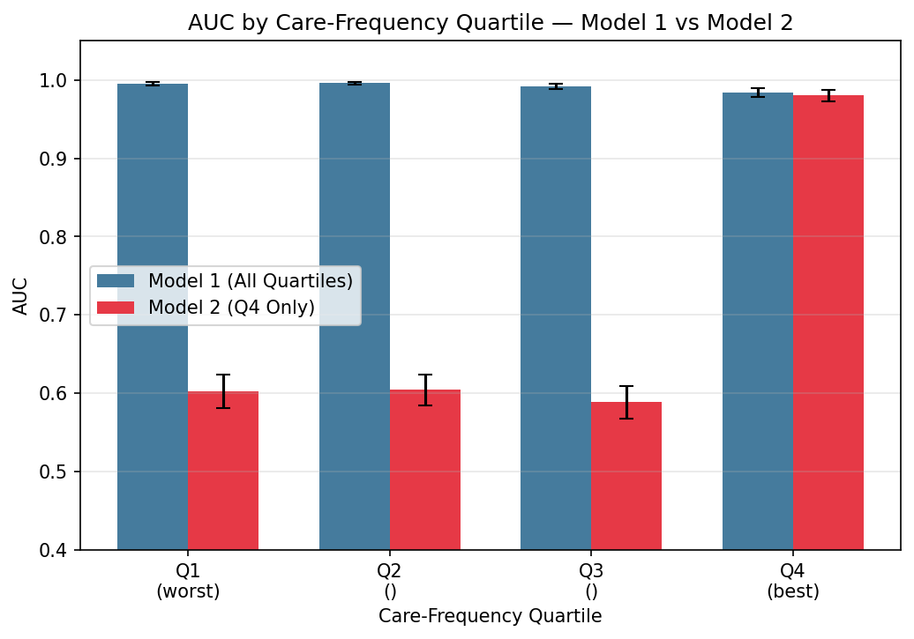
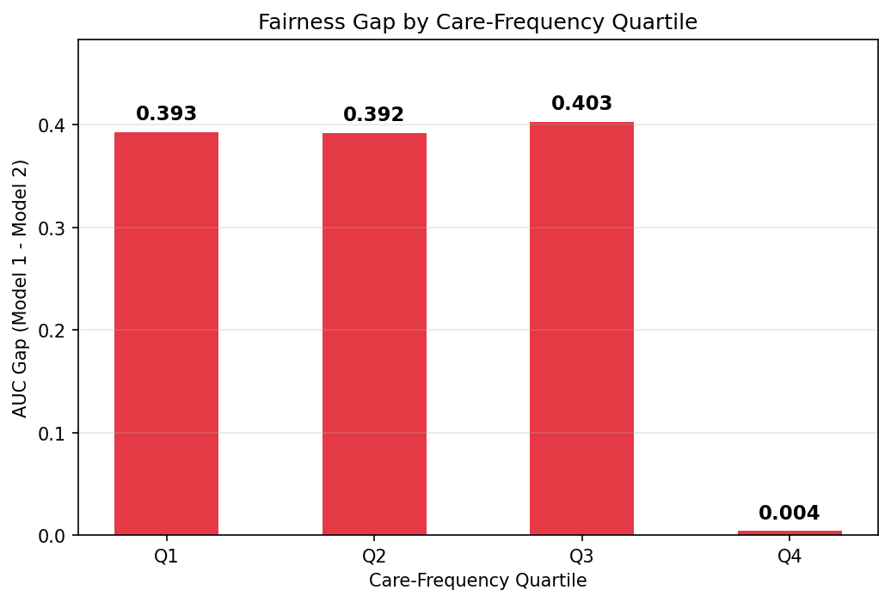
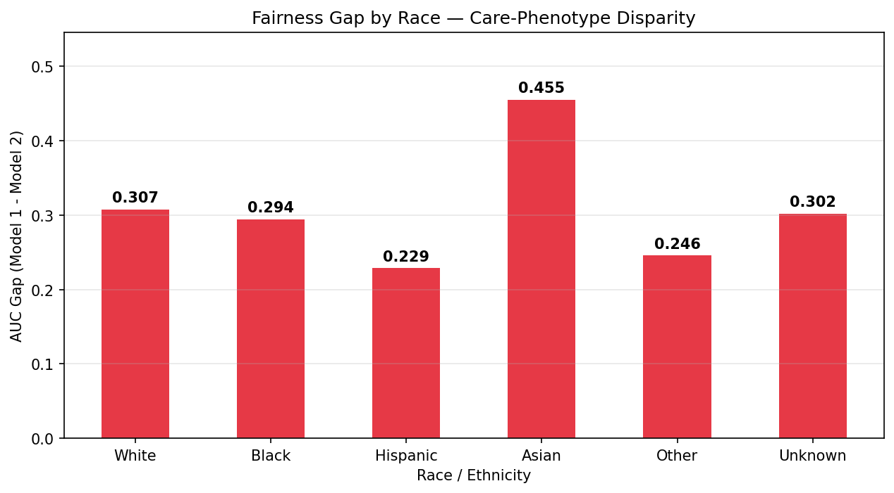
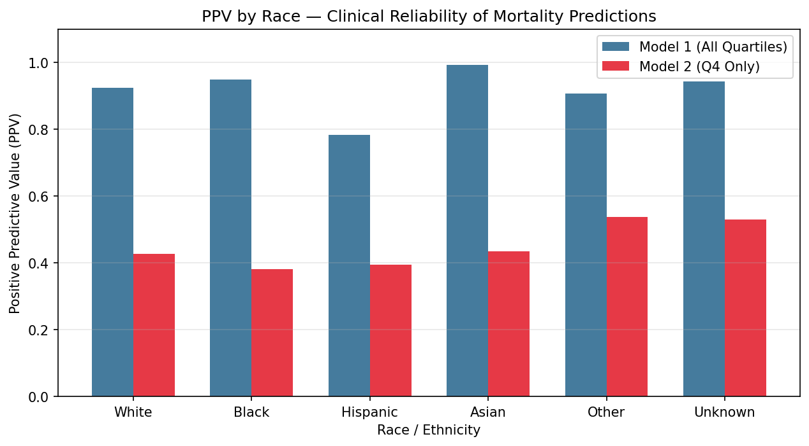

# Phenotypes of Care: Fairness Experiments

Model 1 (trained on all patients) vs Model 2 (trained on Q4 best-care patients only), evaluated across care-frequency quartiles and race/ethnicity groups.

## Table of Contents

- [Setup](#setup)
- [Data Setup](#data-setup)
- [Reproducing Results](#reproducing-results)
- [Experiment 1: Care-Frequency Quartile Evaluation](#experiment-1-care-frequency-quartile-evaluation)
- [Experiment 2: Race-Stratified Evaluation](#experiment-2-race-stratified-evaluation)
- [Key Takeaways](#key-takeaways)

## Setup

Requires macOS with Homebrew, Python 3.12+, and `uv`.

```bash
# 1. System dependency (XGBoost needs OpenMP on macOS)
brew install libomp

# 2. Create virtual environment and install Python dependencies
uv venv --python 3.12
source .venv/bin/activate
uv pip install -r requirements.txt
```

## Data Setup

All CSV data files live in the `data/` directory, which is **gitignored** to protect patient privacy.

```
data/
├── final_cohort.csv                  # 39,811 rows, 33 cols (APS III + LODS features)
├── turning_interval_frequency.csv    # Source for race column
└── final_cohort_with_race.csv        # Generated by merge_race.py
```

Quartile assignment uses `average_item_interval` at the patient level:
- **Q1** = highest interval = worst care (least frequent monitoring)
- **Q4** = lowest interval = best care (most frequent monitoring)

## Reproducing Results

| Script | Purpose | Input | Output |
|--------|---------|-------|--------|
| `merge_race.py` | Joins race from `turning_interval_frequency.csv` into `final_cohort.csv` | `data/final_cohort.csv` + `data/turning_interval_frequency.csv` | `data/final_cohort_with_race.csv` |
| `frequency_experiments.py` | **Experiment 1:** Model 1 vs Model 2 per care-frequency quartile | `data/final_cohort_with_race.csv` | `results/frequency/` |
| `race_experiments.py` | **Experiment 2:** Model 1 vs Model 2 per race/ethnicity group | `data/final_cohort_with_race.csv` | `results/race/` |

```bash
# Place data/final_cohort_with_race.csv (or run merge_race.py to generate it)

python frequency_experiments.py    # Experiment 1
python race_experiments.py         # Experiment 2
```

Both experiments use identical pipelines: class-balanced downsampling (1:1 death/survival), 70/30 stratified split, 5-fold CV with XGBoost grid search (108 hyperparameter combinations), 30% held-out evaluation with 1000-resample bootstrap 95% CIs. `RANDOM_STATE=42` throughout.

---

## Experiment 1: Care-Frequency Quartile Evaluation

Trains Model 1 (all patients) and Model 2 (Q4 only), evaluates both on 30% held-out from each quartile.

**AUC by Quartile (30% held-out):**

| Quartile | Model 1 AUC (95% CI) | Model 2 AUC (95% CI) | Gap (M1 - M2) |
|----------|---------------------|---------------------|----------------|
| Q1 (worst care) | 0.995 (0.993-0.997) | 0.602 (0.581-0.624) | **0.393** |
| Q2 | 0.996 (0.994-0.998) | 0.604 (0.584-0.624) | **0.392** |
| Q3 | 0.992 (0.988-0.995) | 0.589 (0.568-0.609) | **0.403** |
| Q4 (best care) | 0.984 (0.979-0.989) | 0.980 (0.972-0.987) | **0.004** |

Model 2's clinical failure mode on Q1-Q3: Sensitivity ~0.80, Specificity ~0.36. The model over-predicts death because it "expects" Q4-level care — patients who survived despite poor care are flagged as "should have died."






**Full metrics:** `results/frequency/quartile_holdout_model_{1,2}.csv`

---

## Experiment 2: Race-Stratified Evaluation

Same two models, evaluated on 30% held-out from each race/ethnicity group.

**AUC by Race (30% held-out):**

| Race | Model 1 AUC (95% CI) | Model 2 AUC (95% CI) | Gap (M1 - M2) |
|------|---------------------|---------------------|----------------|
| White | 0.993 (0.991-0.995) | 0.685 (0.671-0.699) | 0.308 |
| Black | 0.994 (0.988-0.998) | 0.699 (0.664-0.733) | 0.294 |
| Hispanic | 0.988 (0.979-0.995) | 0.759 (0.707-0.811) | 0.229 |
| Asian | 0.999 (0.997-1.000) | 0.544 (0.484-0.602) | **0.455** |
| Other | 0.985 (0.966-0.998) | 0.739 (0.695-0.781) | 0.246 |
| Unknown | 0.991 (0.987-0.995) | 0.690 (0.664-0.715) | 0.302 |

Model 1 performs uniformly well across all races (~0.99 AUC). A standard demographic fairness audit would conclude: "model is fair." But Model 2 reveals a universal care-quality gap (0.544-0.759), with Asian patients showing the largest disparity.






**Full metrics:** `results/race/race_holdout_model_{1,2}.csv`

---

## Key Takeaways

1. **Care phenotypes are more sensitive than race for fairness evaluation.** Model 2 AUC range across quartiles: **0.391** (0.589-0.980). Across races: **0.215** (0.544-0.759). Quartile stratification exposes nearly twice the variation.

2. **Standard models hide care inequality.** Model 1 achieves ~0.99 AUC across ALL quartiles and ALL races. It has learned to predict death-under-neglect as easily as death-under-optimal-care — encoding the consequences of poor care as biological inevitability.

3. **The fairness gap is universal but unequal.** Model 2 degrades across every race and every non-Q4 quartile. Asian patients show the largest race-specific gap (0.455), suggesting the most variable care quality relative to the best-care baseline.
